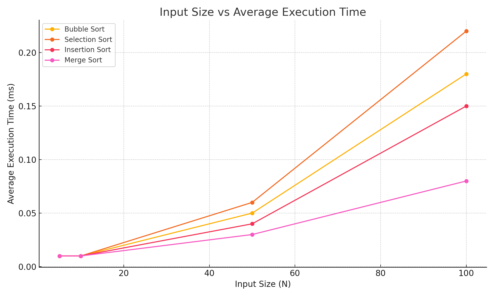

# 54915_Sarmad_SortingAnalysis
Empirical Analysis of Sorting Algorithms in Worst-Case Scenarios

**Project Description**
This project analyzes the performance of four sorting algorithms — **Bubble Sort**, **Selection Sort**, **Insertion Sort**, and **Merge Sort** — by measuring their execution time on different input sizes (5, 10, 50, 100 elements).  
The algorithms are tested in worst-case scenarios, and the empirical results are compared to theoretical time complexities.

**Technologies Used**
- **Language**: C++
- **Compiler**: g++ (or any C++ compiler)

**How to Compile and Run**
1. Clone this repository.
2. Open the terminal/command prompt.
3. Compile the program using:
   ```bash
   g++ main.cpp -o sorting_analysis
**Graph**:


